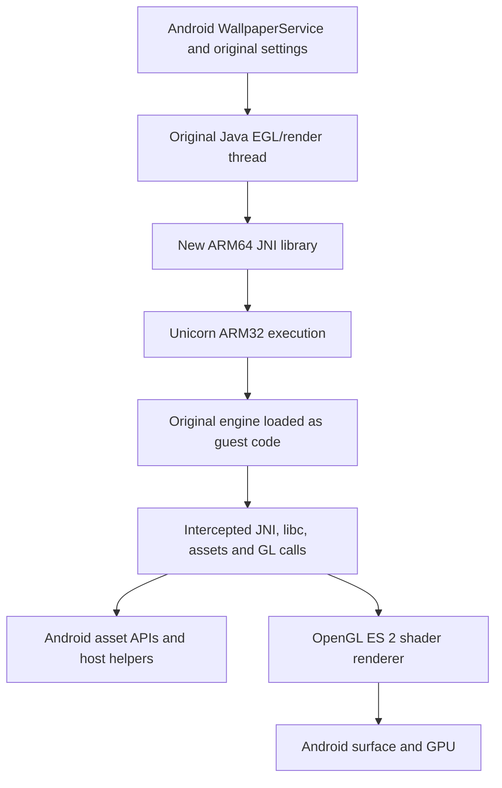

# Technical deep dive

DualReBoot preserves the original scene/simulation code by executing its ARMv7 machine code inside an ARM64 library. It rebuilds the Android/native boundary and graphics path. Six math routines now have tested native C++ replacements; the rest of the simulation still executes as original ARM32 instructions. It does **not** turn Ghidra's output into a natively recompiled copy of every original engine function.

## Original application structure

The analyzed APK is My Beach HD 2.2, package `com.dualboot.apps.beach`, version code 15. It targets SDK 19 and has minimum SDK 9. Its Java side provides activities, settings, wallpaper lifecycle, location handling, an EGL render thread and a JNI interface.

The native engine is custom C++ code using the `STG` namespace. The APK contains three ELF32 libraries named `libdbgengine.so`:

| ABI | Original size |
| --- | ---: |
| `armeabi-v7a` | 447,760 bytes |
| `armeabi` | 460,020 bytes |
| `x86` | 571,140 bytes |

There is no original ARM64 build in this input. Exported C++ names, RTTI-related symbols and JNI exports substantially improve reverse engineering, even though the original class definitions, comments, locals and build system are unavailable.

Useful source entry points:

- [BeachService](../decompiled/sources/com/dualboot/apps/beach/BeachService.java) and [its base](../decompiled/sources/com/dualboot/apps/beach/b.java).
- [Wallpaper engine/lifecycle](../decompiled/sources/com/dualboot/e/n.java).
- [Java EGL/render thread](../decompiled/sources/com/dualboot/c/g.java).
- [Java JNI interface](../decompiled/sources/com/dualboot/engine/EngineInterface.java).
- [Native declarations](../native/jni/com_dualboot_engine_EngineInterface.h).

## Why the original library cannot simply be relabeled

An ARM32 ELF binary contains ARM/Thumb instructions and a 32-bit ABI. A 64-bit app process cannot load it as an ARM64 native library merely because its file is placed under `lib/arm64-v8a`. The same issue remains if Java is rebuilt while the native engine is unchanged. [Android ABI documentation](https://developer.android.com/ndk/guides/abis)

A full native reconstruction is possible work, but it requires recovering the scene structures, serializers, renderer, animation and logic systems into valid source. The reference decompilation includes thousands of compiler/runtime/import entries as well as application code. The compatibility runtime was chosen to preserve working behavior sooner, with a performance cost that now needs substantial investigation.

## Guest address space and ELF loading

[port/runtime.hpp](../port/runtime.hpp) defines a private guest address space. The implementation reserves 128 MiB of host virtual memory and maps it into Unicorn. Guest addresses are translated to offsets within that backing region; they are not host pointers.

| Guest region | Purpose |
| --- | --- |
| Base `0x00010000` | ELF load bias and guest RAM base |
| Around `0x00100000` | Import trampolines and return sentinel |
| `0x00110000` | Synthetic guest JNI environment/table |
| Stack below `0x00400000` | Per-call guest stack space |
| Heap from `0x00500000` | Guest allocations, with free-block coalescing |

The loader checks the expected little-endian ARM32 ELF shape, copies loadable segments, resolves supported dynamic symbols and applies `R_ARM_RELATIVE`, `R_ARM_ABS32`, `R_ARM_GLOB_DAT` and `R_ARM_JUMP_SLOT` relocations. Initializer-array functions execute in the guest. This is a loader for the validated engine, not a general replacement for Android's linker.

The emulated CPU model is Cortex-A15, with VFP enabled. Both ARM and Thumb code can execute. Imported functions resolve to guest trampoline addresses; the hook dispatches recognized calls to C++ helpers and returns to the guest's LR. Most calls return from the hook directly. `pthread_once` is deferred to an outer execution loop because it can call back into guest code; nested guest calls save and restore context.

Invalid guest memory accesses, unsupported imports and execution limits result in explicit errors. The design is not advertised as a general security sandbox for arbitrary third-party code; the build validates the specific engine and app payload before using it.

The guest RAM mapping currently permits guest read/write/execute access across the mapped region. CPU profiling shows translated-block lookup/invalidation costs. Narrower code/data permissions are a possible investigation, not an implemented optimization.

## Pointer width and the JNI contract

The original Java API uses `int` engine handles. Native `Create` returns an allocated `EngineInterface*`, while `Destroy` casts the integer argument back to that pointer. Directly recompiling this ABI for ARM64 would truncate native pointers.

DualReBoot keeps the existing Java signatures, but their integers now identify **guest addresses**. A 32-bit guest pointer remains valid within the emulated memory map, while host pointers retain their full native width. Synthetic Java string/buffer object identifiers also stay separate from native pointers.

All 18 Java-declared JNI methods are implemented by [port/android.cpp](../port/android.cpp):

| Group | Methods |
| --- | --- |
| Lifecycle | `Recreate`, `Destroy`, `GetNeedsReload` |
| Loading | `LoadFile`, `LoadResources`, `AddBitmapData` |
| Frame/time/location | `Update`, `Sleep`, `SetStateLocation` |
| Preferences | Camera set, environment, font message, model swap, model toggle, texture group, time of day, automatic time of day, user image |

The old native library additionally exports `Create`, which the supplied Java interface does not declare. The new library does not need to expose that unused Java method.

The JNI `Update` descriptor is `(IIIFFJDFZ)I`. Its ARM32 argument layout must be marshaled explicitly:

| Word | Value |
| --- | --- |
| 0–1 | Synthetic `JNIEnv*` and class handle |
| 2–4 | Engine, width, height |
| 5–6 | Touch X/Y floats, copied as bit patterns |
| 7 | Padding for the following 64-bit argument |
| 8–9 | Java `long` timestamp |
| 10–11 | Java `double` pan position |
| 12–13 | Fade float and vignette boolean |

This follows the original ARM32 call layout. Copying a decompiler's guessed signature would lose alignment information or misinterpret registers. The generated JNI header is the reliable Java/native declaration contract.

## Host services and lifecycle

The C++ bridge supplies the subset of libc, time, random, allocation, string, JNI and Android asset behavior exercised by this engine. Original assets are opened through `AAssetManager`, copied into guest-owned buffers and released through the guest-facing asset functions. Java strings are represented as both UTF-8 and UTF-16 guest data. Direct image buffers are copied into guest storage before calling the original native routine.

The original engine's standard-library/compiler support mostly remains guest code. The new host wrapper uses the NDK's static C++ runtime. Host function pointers returned by a loader are never passed to guest code as if they were guest addresses.

Native entry points share one recursive mutex and one emulated runtime. This makes the implemented no-op guest mutex operations consistent with serialized entry, and prevents concurrent guest execution through that runtime. It may also cause contention between active wallpaper instances; this is an open performance question.

The bridge only implements the expected dependency subset. Guest statics live for the runtime's lifetime; optional dynamic-unwind lookups return failure. Unexpected waits and unimplemented imports fail explicitly. Asset/image edge cases, every purchase-related path and all holiday combinations have not been exhaustively validated.

## Scene and asset findings

There are 102 original assets:

- `beach.stg-scene`, 759,892 bytes.
- `beach-settings.txt`, a JSON-like settings description parsed as JSON by the app.
- 100 PVR v3 textures.

The scene's first serialized word is version 26. Embedded metadata identifies export time `2014-07-02_20-20-29` and source file `Beach_311.max`. Many serialized values and string lengths are explicitly four bytes. A future native reconstruction must keep that file format separate from ARM64's larger pointer/`long` widths.

All inspected PVR files are uncompressed: 80 RGB565, 11 RGBA4444 and 9 RGB888. The inventory records dimensions, mip counts, channel formats, byte sizes and hashes. Textures, mesh data and the complete scene binary are not committed; the builder extracts them from the supplied APK and verifies their preservation.

Important native references:

- [Engine creation](../native/armeabi-v7a/functions/0006cf88_EngineInterfaceImpl__Create.c).
- [Engine destruction](../native/armeabi-v7a/functions/0006d008_EngineInterfaceImpl__Destroy.c).
- [Scene loading](../native/armeabi-v7a/functions/0006dd94_EngineInterfaceImpl__LoadFile.c).
- [Frame update](../native/armeabi-v7a/functions/0006d3d8_EngineInterfaceImpl__Update.c).
- [Scene deserialization](../native/armeabi-v7a/functions/0005bb8c_STG__USerialize__Load.c).
- [String deserialization](../native/armeabi-v7a/functions/00056928_STG__USerialize__Load_char_int_.c).

## Graphics reconstruction

The original library imports `libGLESv1_CM.so` and fixed-function calls, despite the manifest's ES 2.0 requirement. The first bridge forwarded these to a legacy GL path. Desktop compatibility OpenGL produced the scene, but the Android emulator produced invalid-operation errors and corrupted rendering.

[port/fixed_pipeline.cpp](../port/fixed_pipeline.cpp) implements the subset of fixed-function behavior needed by the scene using GLES 2:

- Model-view, projection and per-texture transforms.
- Vertex colors and optional color/texture-coordinate arrays.
- Three texture stages with supported fixed-function modes and RGB/alpha combiner operands.
- Constant texture environment colors and RGB/alpha scales.
- Alpha testing via fragment discard; blend/depth/cull operations remain host GL calls.
- Vertex/index buffers and client array pointers translated from guest storage/offsets.

State is associated with the current EGL context, with thread-local storage. The shader program and uniform locations are cached. Many state uploads and host function lookups still occur per draw/call. The fragment shader remains a general uniform-controlled implementation, which is a potential GPU/driver cost.

This is not a complete OpenGL ES 1 implementation. For example, the exercised materials are unlit, and unsupported lighting/fog behavior fails explicitly. Multisampling is treated as framebuffer behavior under GLES 2. Claims of complete GL compatibility or pixel-identical parity would exceed the tests performed.

The Java EGL setup required two fixes:

1. Request ES 2-capable configurations and explicitly provide `EGL_CONTEXT_CLIENT_VERSION=2`. The original code compared `EGL_RENDERABLE_TYPE` against exact values 1 and 4, even though modern configurations can advertise a bitmask such as `0x45`.
2. Request RGBA8888 rather than RGB565 to avoid strong night-sky banding. The final day/night emulator screenshots showed the expected textured scene and smoother gradients. Binary screenshots remain outside this repository.

## Packaging and provenance

The builder creates a complete private decode from the supplied APK. Published text references are never treated as a substitute for the missing binary assets.

Compatibility patches are applied only to a temporary copy. The builder replaces all original installed ABI folders with newly compiled 64-bit libraries, raises minimum/target SDK to 24, explicitly exports the existing wallpaper/launcher/settings components, supplies the dream service's binding permission, and normalizes one old invalid style parent for aapt2.

The native engine's bytes are embedded into `engine_bytes.hpp` during the local build. That generated header is a binary payload encoded as source and is explicitly forbidden from Git. The final installed library is ELF64/AArch64; the embedded guest ELF is data, not a library loaded by Android's native linker.

The output is checked for its ABI, JNI exports, native load-segment alignment, APK ZIP alignment, signature, CRC and preservation of the 102 original assets. Native load segments use 16 KB alignment. Actual execution has been tested on 4 KB-page systems; a 16 KB-page physical-device run remains unverified.

Input hashes validate the known program/data revision. They do not prove the user obtained the APK lawfully. A different ZIP signature/compression can be accepted if its supported payload hashes match; unknown or modified payloads fail before decoding.

## What remains difficult

Rendering in a compatibility runtime is not equivalent to the original app's native performance. The phone now exposes a reproducible panning regression that the desktop/emulator functional checks did not settle. Measured improvements cache graphics symbols, let import stubs return naturally, and restrict executable guest pages. CPU timing confirms that translated execution remains significant during touch-driven panning. Read [PERFORMANCE.md](PERFORMANCE.md) for the comparison protocol and remaining limitations.

A future fully native port would still need accurate engine types, serializers, resource ownership, animation/logic behavior and rendering semantics. The preserved symbols and multiple-ABI decompilations are starting points for that work, not a finished reconstruction.

## Incremental native reconstruction

`port/native_math.cpp` reconstructs the original software XYZ blend, three-bone skinning and four matrix products. `runtime_math.cpp` intercepts those exact exports, validates guest ranges and uses original instructions for overlapping operands where equivalence has not been established. Source CI tests the pure native functions; `math-differential` compares them with the locally supplied original ARM32 engine. The 2,200-case comparison passes on the host and on the physical ARM64 phone. This is finite numerical testing, not a proof for every floating-point bit pattern.

The internal blend routine uses AAPCS-VFP (weight in S0, count in R3), unlike the JNI boundary. Software blend/skinning process XYZ at a four-float stride and preserve W. `Transform3x3_Transpose` computes transpose(B) × A in row-major storage. Fused multiply/add is disabled to preserve the original scalar operation order. These details were checked against instructions and differential results rather than inferred solely from decompiler signatures.

The native routines execute during real beach animation, but the isolated phone comparison has not demonstrated a separate FPS benefit from this small native subset. A full native engine still requires reconstructing types, resource ownership, animation and serialization; generated Ghidra pseudocode cannot simply be compiled for ARM64.

Guest memory starts read/write. Only executable ELF segments and the import-stub region receive execute permission. The original validated ELF has separate code and data pages. This avoids Unicorn checking heap and stack writes for self-modifying code. These are emulator permissions; the embedded ARM32 ELF remains data from Android's perspective. Import stubs already contain `bx lr`, so ordinary host calls no longer write the guest program counter and force an emulator exit. Calls that reenter guest execution (`pthread_once`) still use the deferred outer loop.

The guest page permissions are a performance and guest-instruction access policy, not a sandbox boundary. Host bridge routines write through the backing pointer and do not enforce those permissions. This runtime accepts only the pinned, validated engine; it is not intended to safely execute arbitrary or self-modifying guest code.
